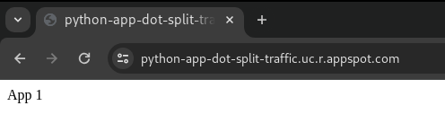

# Splitting traffic in google cloud app engine

<div align="center">
  
</div>

In this project, I will show you how to split traffic in app engine, where you can specify a percentage distribution of traffic across two or more of the versions of your application.

## Required:
  - Google Cloud Account.
  - Gcloud CLI installed.


## What is app engine ?

**App Engine is a fully managed, serverless platform for developing and hosting web applications at scale**. You can choose from several popular languages, libraries, and frameworks to develop your apps, and then **let App Engine take care of provisioning servers and scaling your app instances based on demand.**

## Create a project and enable required cloud APIs.

After being authenticated in gcloud command run these commands below to create a project and enable required APIs, if you don't know how to be authenticated [click here](https://cloud.google.com/docs/authentication/gcloud), or you can use [cloud shell](https://cloud.google.com/shell/docs/launching-cloud-shell) to run these commands.


Let's create a project, in this example I'm calling my project of **split-traffic**, you also can set the name of your project in a variable called running an export command in your shell/bash:<br>
<pre>
export PROJECT_ID=split-traffic
</pre>

Create a project:
<pre>
gcloud projects create $PROJECT_ID
</pre>

Set project in your shell:
<pre>
gcloud config set project $PROJECT_ID
</pre>

Enable app-engine API:
<pre>
gcloud services enable appengine.googleapis.com --project $PROJECT_ID
</pre>


After you run these commands, you'll can see in your project the initial page of App Engine:


## Deploy web application

In app engine we have a 2 kind of environments, they're standard and flexible, in this example we will deploy the app using the standard environment, if you want to know more about the difference of these environments [click here](https://cloud.google.com/appengine/docs/the-appengine-environments).

Access the app directory:
<pre>
cd app/
</pre>

Deploying app:
<pre>
gcloud app deploy app.yaml --project $PROJECT_ID
</pre>
this is an example of the command output:


After you deploy the app, the app engine will generate a Default URL following the template below:

https://**VERSION**-dot-**SERVICE**-dot-**PROJECT_ID**.**REGION_ID**.r.appspot.com


 - **VERSION**: is the name of your version, and the version name can contain numbers, letters, and hyphens, you also can omit "**VERSION**-dot-" if you don't need to target a specific version, in this project I'm not setting any version name on my configuration file ([app/app.yaml](app/app.yaml)). 
 - **SERVICE**: is the app name, in this case.
 - **PROJECT_ID**: is the project ID where's you activated the app engine resource and deployed the app, I've created a project with PROJECT_ID called.
 - **REGION_ID**: The app engine is a region resource, in this case chose ```us-central```

In this case, I will access the app using this URL:

https://python-app-dot-split-traffic.uc.r.appspot.com



## App engine components

It's really important we know the app engine components, to understand about how we can split traffic in this resource. 


The App Engine **application** is a top-level container that includes the **service**, **version**, and **instance** resources that make up your app.

When we deploy the python app using the command "gcloud app deploy ....[]" a **service** called "python-app" was instantly created and **the service in the app engine can have one or more versions**, you can list the versions using the command:
<pre>
gcloud app versions list --service=python-app --project $PROJECT_ID
</pre>
output:


The **versions** run on the **instances**, and what I'm going to do is create a new version of "python-app" service and with this second version deployed, we can split the traffic so that only a percentage of accesses view the new version

In the next steps below, I'll show you how to deploy a new version of our python app, and split traffic between these versions. 

## Deploy the new version

To create a new version of our app, let's start editing our [main.py](app/main.py) file, and change the message string that was being returned to the function, from "App 1" to "App 2".


After making the change and saving it, let's deploy the new version of service python-app, this version I'll call it of "potato-version".

Access de app directory:
<pre>
cd app/
</pre>

Deploy the new version:
<pre>
gcloud app deploy app.yaml --project $PROJECT_ID --version potato-version --no-promote
</pre>
output:

In the command used to deploy the new version, 2 very important arguments were used, which are:
 
  - --version: where we set the name of version.
  - --no-promote: this command is to version of we're deploying do not receive all traffic:

Now we can list the versions and see the potato-version deployed.
<pre>
gcloud app versions list --service=python-app --project $PROJECT_ID
</pre>
Output:


## Splitting traffic between the services

You can use traffic splitting to specify a percentage distribution of traffic across two or more of the versions within a service. Splitting traffic allows you to conduct A/B testing between your versions and provides control over the pace when rolling out features.

Syntax:
<pre>
gcloud app services set-traffic [MY_SERVICE] --splits [MY_VERSION1]=[VERSION1_WEIGHT],[MY_VERSION2]=[VERSION2_WEIGHT] --split-by [IP_OR_COOKIE_OR_RANDOM]
</pre>

split traffic:
<pre>
gcloud app services set-traffic python-app --splits 20240117t144713=0.5,potato-version=0.5 --split-by random --project $PROJECT_ID
</pre>
Output:


### Testing
I've created a script to test, and added to this repository, the script file is [script.sh](./script.sh).

To run this script you need to give execute permission in your shell, to do this run the following command:
<pre>
sudo chmod +x script.sh
</pre>

Run the script.sh using the syntax:
<pre>
./script.sh your-host.appspot.com
</pre>

And the output we can see, the traffic being split between the different versions.


## Migrate traffic

Let's migrate all traffic to our newest version, and turn off the traffic for old version

Syntax:
<pre>
gcloud app services set-traffic [MY_SERVICE] --splits [MY_VERSION]=1
</pre>
Executing this command you will migrate all traffic immediately, but if you want to migrate gradually, add this flag in the command.

Command:
<pre>
gcloud app services set-traffic python-app --splits potato-version=1 --project $PROJECT_ID
</pre>
output:


Now you can see, that all traffic is only in one version:


## Conclusion

App engine is a powerful and had awesome functionalities, the split traffic resource is so good to production environments, and you can test new versions of service and have a good rollback speed.


